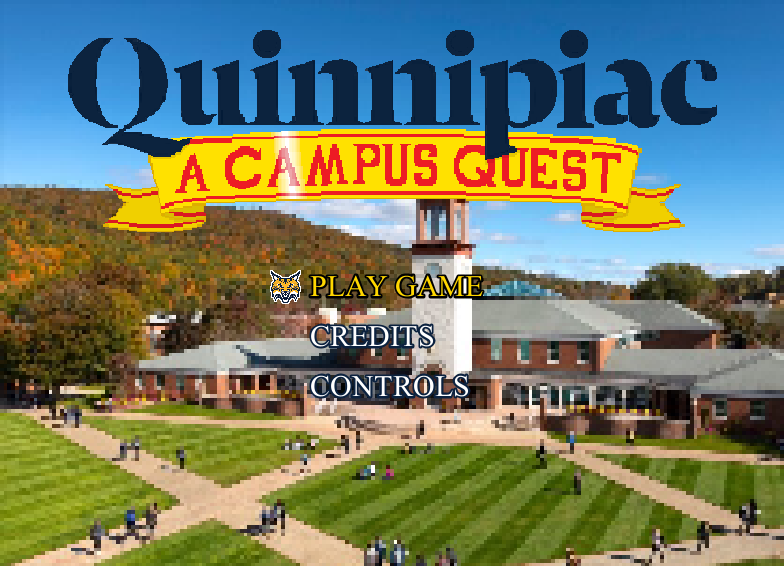

<p align="center">
  
</p>

# Quinnipiac: A Campus Quest

Welcome to Quinnipiac University! As a new student you will get to explore campus exploring all the academic buildings, completing fun quests, and interacting with all of the school's wacky characters!

## Controls

This game has a number of controls that are straight forward:

- Up Arrow - Move Upwards
- Down Arrow - Move Downwards
- Left Arrow - Move Left
- Right Arrow - Move Right
- Space Bar - Interact
- Q - Quest Menu
- Shift - Sprint
- Esc - Options
- E - Use Bike  

## Running the game

There are two main ways to run this game, either through the source code or the JAR file. For running the game, make sure you have a minimum of Java 8.

### Downloading the source code

Clone the repository:

```shell
git clone https://github.com/Sligertiger1230/SER-225-Game
cd SER-225-Game
```

Note that in the source code, we have two programs: the game itself and a tile editor. Here is how to run each one:

- Game - Navigate to `Game.java` and run
- Tile Editor - Navigate to `MapEditor.java` and run

### Downloading the JAR file

At [https://a-r-t.github.io/SER225-Project-Website/semesters/fall2023/teams/art](https://a-r-t.github.io/SER225-Project-Website/semesters/fall2023/teams/art) you can find a page for our game. 
If you scroll to the bottom of the page you will find the download for the game's JAR file. 
Simply open the file by right clicking on it and pressing "Open".


## Documentation

The base game was originally created by [Alex Thimineur](https://github.com/a-r-t). 
Documentation for how the engine, NPCs, screens, and much more works can be accessed at [his documentation website](https://a-r-t.github.io/SER-225-Game-RPG/).

## Credits

- Alex Thimineur, Project Manager
- Julia Bock, Developer
- Brooks Jackson, Developer
- Hayden Lacy, Developer
- Connor Ryan, Developer
- Ryan Sliger, Developer
